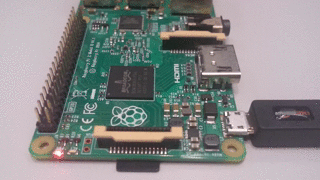

# Raspberry Pi Bare Metal Blinker

Run one command, get a bare metal hello world blinker image that blinks the OK LED. Tested on Ubuntu 16.04 host, Raspberry Pi 2. Usage:

1.  Insert SD card on host

1.  Make the image:

        ./make.sh /dev/mmblck0 p1

    Where:

    - `/dev/mmblck0` is the device of the SD card
    - `p1` is the first partition of the device (`/dev/mmblck0p1`)

1.  Inset SD card on PI

1.  Turn power off and on

There are many comprehensive bare metal resources out there, but it was hard to get the first example working, because you have to download some random blobs and put them together.

Making the first hello world easy is the only goal of this tutorial. The blinker code was adapted from: <https://github.com/dwelch67/raspberrypi> which was the most comprehensive Raspberry Pi bare metal resource available at the time.

Also explained at:

- <http://stackoverflow.com/questions/29837892/running-a-c-program-with-no-os-on-raspberry-pi/40063032#40063032>
- <https://raspberrypi.stackexchange.com/questions/542/using-raspberry-pi-without-a-linux-os/56372#56372>
